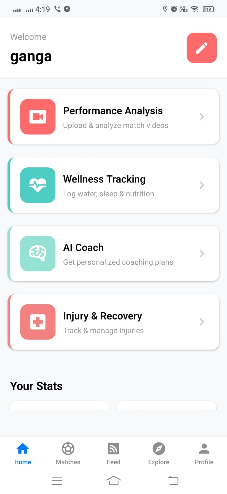
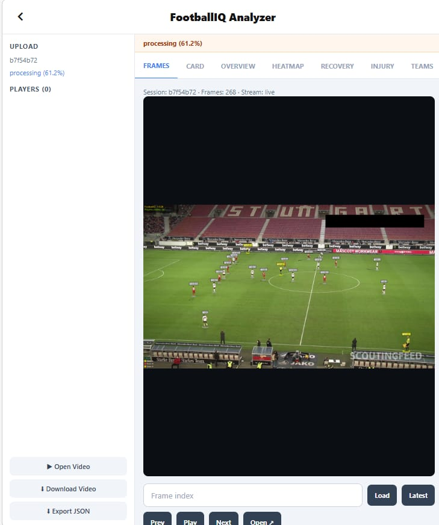
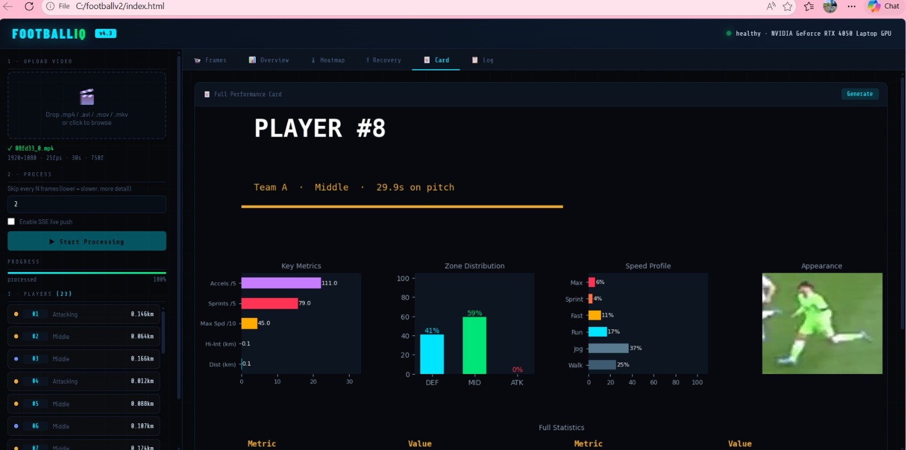
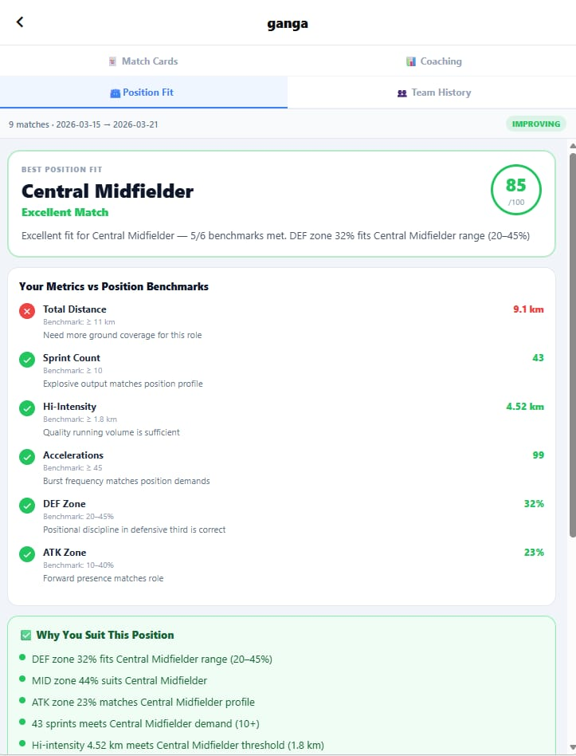
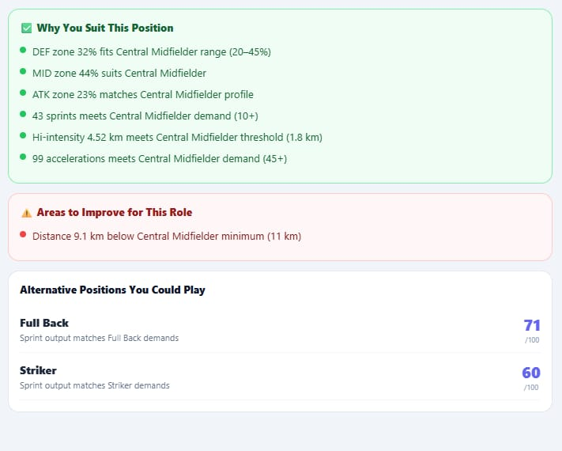
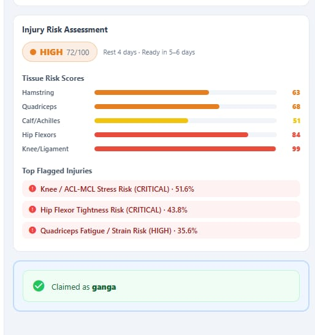
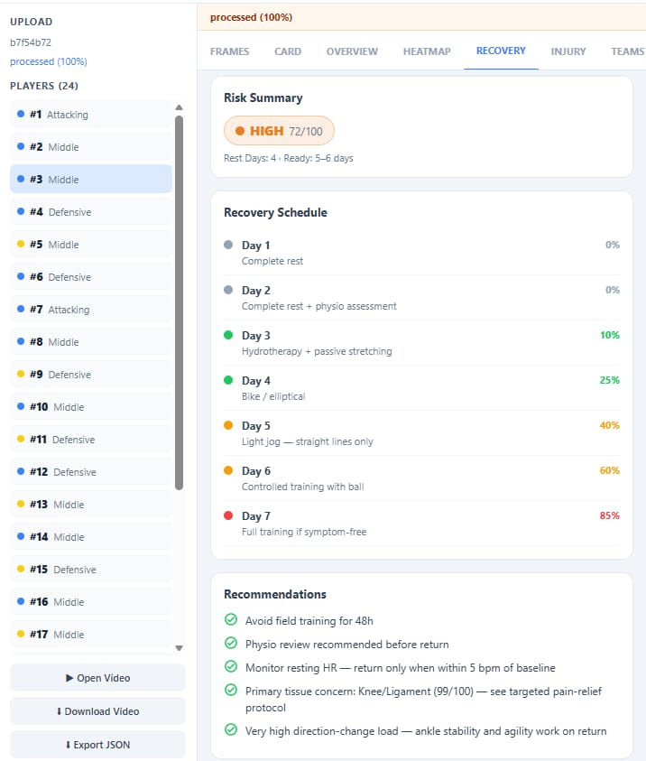
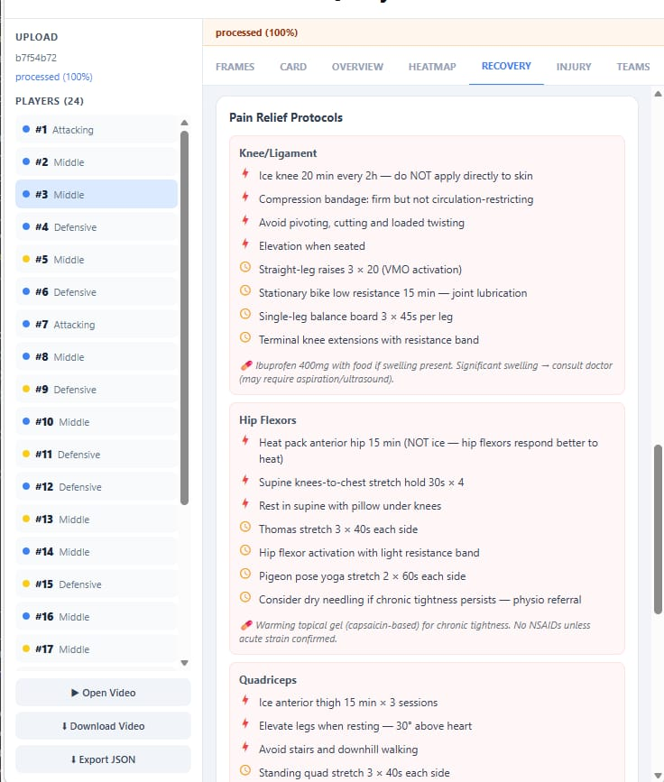

# ⚽ FootballIQ — AI Based Player Performance Analyzer and Wellness Monitoring System

[](https://doi.org/10.5281/zenodo.19205115)
[]()
[]()
[]()

> **B.Tech Final Year Project** — Department of Computer Science and Engineering
> Toc H Institute of Science and Technology, Arakkunnam, Ernakulam, Kerala
> APJ Abdul Kalam Technological University · March 2026

FootballIQ is an integrated AI-driven football analytics platform that analyses match footage, tracks every player, generates personalised performance cards, predicts injury risk, produces recovery plans, monitors wellness, and delivers AI coaching recommendations — all from a standard match video, with no GPS trackers or wearables required.

**📄 Published Paper:** Gangalekshmi KB, Irin Mathew, Krishnendu B Menon, Neha Prasannan, Bini Mol NC — *"Comprehensive AI Based Player Performance Analyzer and Wellness Monitoring System"*, International Journal of Engineering Research & Technology (IJERT), Vol. 15, Issue 03, March 2026. [DOI: 10.5281/zenodo.19205115](https://doi.org/10.5281/zenodo.19205115)

---

## 📌 Note on Repository Contents

> Due to GitHub's file size restrictions, the full codebase, trained model weights, and datasets could not be pushed to a single repository. This README documents the complete system design and results.
>
> - **🚀 Main application (setup & running instructions):** [footballv2](https://github.com/Irin-mathew/footballv2)
> - **📓 Model training notebooks (YOLOv8 detection + tracking pipeline):** [Player_Performance_analyzer notebooks](https://github.com/Irin-mathew/Player_Performance_analyzer-/tree/main/examples/soccer/notebooks)

---

## Overview

FootballIQ democratises access to professional-grade sports analytics for amateur and semi-professional players. It is built around four core modules:

| Module | Function |
|--------|----------|
| **Performance Analysis** | Video → player tracking → stats → player cards → heatmaps |
| **Injury Prediction & Recovery** | Workload → per-tissue risk scores → personalised recovery plan |
| **Health & Wellness Monitoring** | Nutrition → BMI → sleep → hydration → dietary plan |
| **AI Coaching** | Aggregated data → position fit → training plan → coaching report |

All modules are wrapped in a social platform with match organisation, team management, and talent discovery, accessible via a cross-platform mobile app.

## System Architecture

```
Data Acquisition  →  AI Processing  →  Application Logic  →  Presentation
 (Mobile Upload)     (YOLOv8, ByteTrack,   (Coaching, Wellness,   (Dashboards,
                      ReID, HSV, Speed/       Injury, Player          Social Feed)
                      Distance Engine)        Cards)
```

---

## Module 1 — Performance Analysis & Player Card Generation

Converts raw match video into structured performance data via a multi-stage computer vision pipeline:

- **YOLOv8x Player Detection** — custom-trained model (4 classes: ball, goalkeeper, player, referee) achieving **92% mAP@50**. Processes every 2nd frame for ~48% fewer inference calls with negligible tracking loss.
- **ByteTrack Multi-Object Tracking** — assigns stable IDs across the match using both high- and low-confidence detections, making it robust to occlusion.
- **Custom ReID (PlayerGallery)** — an appearance-based re-identification layer using HSV torso histograms + EMA feature updates to recover player identity after prolonged occlusion or full frame exit. IDs are never recycled.
- **HSV Team Classification** — unsupervised KMeans (k=2) clustering on jersey colour, robust to lighting variation.
- **Referee/Duplicate Suppression** — NMS + class filtering ensures referees never contaminate player statistics.
- **View Transformer** — converts pixel coordinates to real-world pitch metres (105m × 68m) for physically accurate distance/speed metrics and zone classification.
- **Speed & Distance Engine** — computes total/high-intensity/sprint distances, accelerations, decelerations, and speed-band percentages per player.
- **Annotation Engine** — ground-plane ellipses and fading motion trails for intuitive visual tracking.
- **Player Cards & Heatmaps** — auto-generated PNG reports with zone distribution, speed profile, and Gaussian-smoothed positional heatmaps.

**Performance:** ~22ms/frame on GPU (vs ~180ms CPU) — an 8× speedup enabling a 90-minute match to process in under 30 minutes.

## Module 2 — Injury Prediction & Recovery

- **Per-Tissue Injury Engine** — scores 5 tissue groups (hamstring, quadriceps, calf/achilles, hip flexors, knee/ligament) on a 0–100 scale using threshold-based rules from sports science literature, with position-specific multipliers.
- **Tissue Tiers** — CRITICAL / HIGH / MODERATE / LOW / MINIMAL, each mapping to specific field-training restrictions.
- **Recovery Planner** — generates a fatigue score, return-to-play timeline (1–8 days), day-by-day recovery schedule with intensity ramp, tissue-specific pain relief protocols, and nutrition targets.
- **Recovery Card Generator** — visual PNG summary of risk tier, tissue scores, and recovery schedule.

## Module 3 — Health & Wellness Monitoring

- **Food Image Classification** — CNN-based food recognition with a two-stage validation pipeline (pixel-quality checks + classifier confidence checks) to reject invalid images. Achieves **89.4% validation accuracy**, **95.6% top-3 accuracy**.
- **Calorie & Macronutrient Prediction** — a Keras neural network predicts protein/carb/fat splits from user profile data; meal plans assembled from a 3,800+ item food database.
- **Wellness Dashboard** — daily tracking of BMI, hydration, sleep, calories, and macros with personalised recommendations.

## Module 4 — AI Coaching

- **Performance Coach** — longitudinal coaching reports from career averages, personal bests, and best/worst match scoring, with next-session load instructions based on injury tier and fatigue signals.
- **Position Fit Analysis** — scores players 0–100 against 7 position benchmarks (Striker, Attacking Mid, Central Mid, Full Back, Centre Back, Defensive Mid, Wide Forward), returning confidence tier, top alternatives, and improvement areas.
- **Fitness Coach** — rule-based workout and meal plan generator gated by injury tier, medical conditions, and training goals.

## Social Platform & Mobile App

Built with **React Native + Expo** for iOS, Android, and Web, featuring:

- Live annotated video streaming during processing (SSE)
- Player card claiming and native sharing (WhatsApp, Instagram, etc.)
- Match organisation, team management, leaderboards
- Coach directory and talent discovery for scouts
- Recovery checklists with progress tracking

---

## Sample Outputs

<table>
<tr>
<td width="50%">

**Mobile App — Home Screen**


</td>
<td width="50%">

**Live Frame Streaming During Processing**


</td>
</tr>
<tr>
<td width="50%">

**Full Performance Card**


</td>
<td width="50%">

**Career Stats — Best vs Worst Match & Injury Risk Trend**


</td>
</tr>
<tr>
<td width="50%">

**Position Fit — Score & Benchmarks**


</td>
<td width="50%">

**Position Fit — Strengths & Alternatives**


</td>
</tr>
<tr>
<td width="50%">

**Injury Risk Assessment**


</td>
<td width="50%">

**Recovery Schedule & Risk Summary**


</td>
</tr>
</table>

**Recovery — Pain Relief Protocols**


---

## Performance Results

| Area | Metric | Value |
|------|--------|-------|
| Detection | YOLOv8 mAP@50 | 92% |
| Tracking | ByteTrack temporal accuracy | >92% |
| Processing | GPU inference | ~22 ms/frame (8× faster than CPU) |
| Processing | 90-min match (GPU) | < 30 minutes |
| Nutrition | Food classification accuracy | 89.4% (val), 95.6% (top-3) |
| Nutrition | Calorie estimation error | ±12% MAE |

---

## Tech Stack

**Backend:** Python 3.10+, FastAPI, Uvicorn, YOLOv8 (Ultralytics), ByteTrack (Supervision), PyTorch, OpenCV, Matplotlib, SciPy, scikit-learn, TensorFlow/Keras, Flask, MongoDB

**Mobile App:** React Native, Expo, TypeScript, Expo Router, AsyncStorage

---

## Repository & Setup

Full setup and running instructions (backend + mobile app) are maintained in the main application repository:

👉 **[github.com/Irin-mathew/footballv2](https://github.com/Irin-mathew/footballv2)**

Model training notebooks (YOLOv8 detection & tracking) are available here:

👉 **[Player_Performance_analyzer — training notebooks](https://github.com/Irin-mathew/Player_Performance_analyzer-/tree/main/examples/soccer/notebooks)**

---

## Team

| Name | Role |
|------|------|
| **Irin Mathew** (TOC22CS081) | Player Card Module · Injury Recovery Module · AI Coaching Module (Core) |
| **Gangalekshmi KB** | Entire App Development & Integration · AI Coaching Module (Part) |
| **Krishnendu B Menon** | Health & Wellness Module (Core) |
| **Neha Prasannan** | Health & Wellness Module (Part) · Documentation |

**Project Guide:** Ms. Bini Mol N C, Assistant Professor, CSE, TIST
**Project Coordinator:** Mr. Sharath P Raju, Assistant Professor, CSE, TIST
**Head of Department:** Prof. (Dr.) Sreela Sreedhar
**Principal:** Prof. (Dr.) Preethi Thekkath

---

## Citation

```bibtex
@article{footballiq2026,
  author    = {Gangalekshmi KB and Irin Mathew and Krishnendu B Menon and Neha Prasannan and Bini Mol NC},
  title     = {Comprehensive AI Based Player Performance Analyzer and Wellness Monitoring System},
  journal   = {International Journal of Engineering Research Technology (IJERT)},
  volume    = {15},
  number    = {03},
  year      = {2026},
  doi       = {10.5281/zenodo.19205115},
  url       = {https://doi.org/10.5281/zenodo.19205115}
}
```

## License

This project is submitted in partial fulfillment of the requirements for the award of the degree of Bachelor of Technology in Computer Science and Engineering, APJ Abdul Kalam Technological University, Kerala. All rights reserved.

---

*Department of Computer Science and Engineering · Toc H Institute of Science and Technology · Arakkunnam, Ernakulam, Kerala – 682 313*